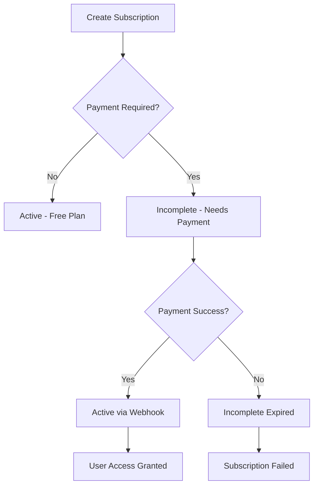

# Webhook-Driven Subscription Confirmation Flow

## 🔄 Overview

This guide explains how to implement proper webhook-driven subscription confirmation instead of relying on immediate API responses. This approach is essential for production SaaS applications.

## 🎯 Why Webhooks Are Critical

1. **Asynchronous Processing**: Stripe processes payments asynchronously
2. **3D Secure Authentication**: Some payments require user authentication
3. **Payment Failures**: Cards can be declined after subscription creation
4. **Network Issues**: API calls can timeout but webhooks ensure consistency
5. **Regulatory Compliance**: SCA (Strong Customer Authentication) requirements

## 📊 Subscription States Flow



## 🔧 Backend Implementation

### 1. Subscription Creation Response

```typescript
// POST /api/subscriptions
{
  "success": true,
  "message": "Subscription created - payment confirmation required",
  "data": {
    "subscription": { /* DB subscription object */ },
    "status": "incomplete",
    "requiresAction": true,
    "clientSecret": "pi_1234_secret_5678" // For payment confirmation
  }
}
```

### 2. Status Polling Endpoint

```typescript
// GET /api/subscriptions/:id/status
{
  "success": true,
  "data": {
    "subscription": { /* Full subscription data */ },
    "status": "active", // Current status from Stripe
    "isActive": true,
    "requiresPayment": false
  }
}
```

### 3. Webhook Event Handling

#### Key Events for Subscription Confirmation:
```typescript
// Webhooks update subscription status automatically
customer.subscription.created    → status: 'incomplete' | 'active'
customer.subscription.updated    → status changes (incomplete → active)
invoice.payment_succeeded        → Payment confirmed
invoice.payment_failed          → Payment failed
```

## 🎨 Frontend Implementation

### 1. Subscription Creation Flow

```typescript
// components/SubscriptionFlow.tsx
const handleCreateSubscription = async (planId: string) => {
  try {
    const response = await subscriptionService.create({ planId });
    
    if (response.success) {
      const { subscription, status, requiresAction, clientSecret } = response.data;
      
      if (status === 'active') {
        // Free plan or immediate success
        router.push('/dashboard?subscribed=true');
        return;
      }
      
      if (status === 'incomplete' && requiresAction && clientSecret) {
        // Handle payment confirmation
        await handlePaymentConfirmation(subscription._id, clientSecret);
      } else {
        // Poll for status updates
        await pollSubscriptionStatus(subscription._id);
      }
    }
  } catch (error) {
    console.error('Subscription creation failed:', error);
  }
};
```

### 2. Payment Confirmation (3D Secure/SCA)

```typescript
const handlePaymentConfirmation = async (subscriptionId: string, clientSecret: string) => {
  const stripe = await stripePromise;
  if (!stripe) return;
  
  // Confirm payment with 3D Secure if needed
  const { error } = await stripe.confirmPayment({
    elements, // Your Stripe Elements
    clientSecret,
    confirmParams: {
      return_url: `${window.location.origin}/subscription/confirm?subscription_id=${subscriptionId}`,
    },
  });
  
  if (error) {
    console.error('Payment confirmation failed:', error);
    // Handle payment failure
  } else {
    // Start polling for confirmation
    await pollSubscriptionStatus(subscriptionId);
  }
};
```

### 3. Status Polling

```typescript
const pollSubscriptionStatus = async (subscriptionId: string, maxAttempts = 30) => {
  let attempts = 0;
  
  const poll = async (): Promise<boolean> => {
    try {
      const response = await subscriptionService.getStatus(subscriptionId);
      
      if (response.success) {
        const { status, isActive } = response.data;
        
        if (isActive) {
          // Subscription confirmed!
          toast.success('Subscription activated successfully!');
          router.push('/dashboard?subscribed=true');
          return true;
        }
        
        if (['incomplete_expired', 'canceled'].includes(status)) {
          // Subscription failed
          toast.error('Subscription activation failed');
          return true;
        }
      }
      
      attempts++;
      if (attempts >= maxAttempts) {
        toast.error('Subscription confirmation timeout');
        return true;
      }
      
      // Continue polling
      setTimeout(() => poll(), 2000); // Poll every 2 seconds
      return false;
      
    } catch (error) {
      console.error('Status polling error:', error);
      return true; // Stop polling on error
    }
  };
  
  return poll();
};
```

### 4. API Service Updates

```typescript
// lib/api.ts
export const subscriptionService = {
  async create(data: { planId: string, paymentMethodId?: string }) {
    return api.post('/subscriptions', data);
  },
  
  async getStatus(subscriptionId: string) {
    return api.get(`/subscriptions/${subscriptionId}/status`);
  },
  
  // ... other methods
};
```

## 🔗 Complete Flow Example

### 1. User Clicks "Subscribe to Premium"

```typescript
// Frontend initiates subscription
const response = await subscriptionService.create({ 
  planId: 'premium_plan_id',
  paymentMethodId: 'pm_card123' 
});

// Response: { status: 'incomplete', requiresAction: true, clientSecret: '...' }
```

### 2. Handle Payment Confirmation

```typescript
// If payment required, handle 3D Secure
if (response.data.requiresAction) {
  await stripe.confirmPayment({
    clientSecret: response.data.clientSecret,
    // ... confirmation params
  });
}
```

### 3. Poll for Webhook Confirmation

```typescript
// Frontend polls status every 2 seconds
while (attempts < 30) {
  const status = await subscriptionService.getStatus(subscriptionId);
  
  if (status.data.isActive) {
    // ✅ Webhook confirmed subscription!
    redirectToDashboard();
    break;
  }
  
  await delay(2000);
}
```

### 4. Webhook Updates Database

```typescript
// Webhook: customer.subscription.updated
// Automatically updates subscription status to 'active'
// User gets immediate access on next poll
```

## 🚨 Error Handling

### Common Scenarios

1. **Payment Declined**: Status remains `incomplete` → Show retry option
2. **3D Secure Failed**: Status becomes `incomplete_expired` → Show failure message  
3. **Network Timeout**: Continue polling → Webhooks ensure consistency
4. **Webhook Delay**: Local status check → Fallback to Stripe API

### Frontend Error States

```typescript
const SubscriptionStatus = {
  PENDING: 'pending',           // Creating subscription
  REQUIRES_ACTION: 'requires_action', // 3D Secure needed
  PROCESSING: 'processing',     // Waiting for webhook
  ACTIVE: 'active',            // Success!
  FAILED: 'failed',            // Payment failed
  EXPIRED: 'expired'           // Timeout/expired
};
```

## 📝 Stripe Dashboard Configuration

### Required Webhook Events

Configure these events in your Stripe Dashboard:

```bash
# Subscription lifecycle
customer.subscription.created
customer.subscription.updated  
customer.subscription.deleted

# Payment confirmation
invoice.payment_succeeded
invoice.payment_failed

# Advanced notifications
customer.subscription.trial_will_end
invoice.upcoming
```

### Webhook Endpoint

```bash
URL: https://yourdomain.com/api/webhooks/stripe
Events: Select the events listed above
```

## 🎯 Benefits of This Approach

1. **Reliable**: Webhooks ensure status accuracy
2. **Secure**: Prevents race conditions and timing issues  
3. **Compliant**: Handles SCA/3D Secure properly
4. **User-Friendly**: Clear status updates and error handling
5. **Scalable**: Works with any payment complexity

## 🔍 Testing

1. **Use Stripe Test Cards**: Including 3D Secure test cards
2. **Simulate Webhook Delays**: Test polling behavior
3. **Test Failed Payments**: Ensure proper error handling
4. **Network Interruption**: Verify webhook reliability

This webhook-driven approach ensures your subscription system is production-ready and handles all edge cases properly! 🚀 